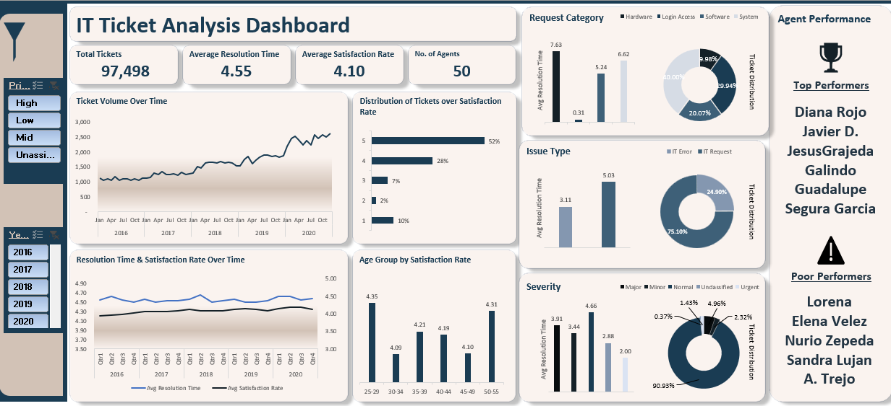

# IT Support Ticket Analysis & Dashboard in Excel 📊

---

## 📌 Project Overview
This project analyzes **97,498 IT support tickets** over a **5-year period** to uncover key insights into **IT helpdesk performance, agent efficiency, and customer satisfaction**.  
The work was done entirely in **Microsoft Excel**, using **data cleaning, data transformation, pivot tables, statistical analysis, and a dynamic dashboard** to support data-driven decision-making.

The analysis identifies:
- Performance trends and workload patterns
- Resolution time efficiency
- Satisfaction scores by issue type and agent
- Bottlenecks in processes (priority vs. severity mismatches)
- Recommendations for staffing, training, and technology upgrades

---

## 🎯 Objectives
- **Evaluate IT support efficiency** based on ticket volumes, resolution times, and user satisfaction.
- **Identify trends** in support requests over time and severity levels.
- **Analyze agent performance** to recognise top performers and highlight those needing training.
- **Recommend actions** to improve operational efficiency and customer satisfaction.
- **Create a dynamic dashboard** for ongoing performance tracking.

---

## 📂 Data Sources & Structure
Two datasets were used:
1. **Tickets Dataset** – Ticket ID, category, issue type, resolution time, severity, priority, satisfaction rate, date, agent ID.
2. **IT Agents Dataset** – Agent ID, name, email, date of birth, contact details, assigned tickets.

**Data Size:**  
- **Tickets:** 97,498 records  
- **Agents:** Multiple attributes for each IT support staff member  

---

## 🛠 Methodology
**1. Data Cleaning**
- Corrected typos: e.g., `"Mayor"` → `"Major"`, `"Unclasified"` → `"Unclassified"`, `"Unassiged"` → `"Unassigned"`.
- Ensured uniform formatting for categorical fields.
- Verified data integrity — no missing values.

**2. Data Transformation**
- Extracted email domains using Excel formulas.
- Calculated agent ages from birth dates.
- Created new fields for analysis (e.g., daily ticket volume, resolution time averages).

**3. Analysis**
- Pivot tables to calculate:
  - Daily, monthly, and yearly ticket volumes
  - Category-wise and severity-wise resolution times
  - Agent-wise performance metrics (resolution time & satisfaction rate)
- Correlation analysis between severity and resolution times.
- Trend analysis: seasonal, quarterly, and yearly patterns.

**4. Visualization**
- Created **dynamic, filterable Excel dashboard** with KPIs, charts, and slicers to enable real-time insight extraction.

---

## 📊 Key Insights
- **Ticket Volume Growth:** Increased consistently year-on-year; peak in Dec 2020.
- **Average Resolution Time:** 4.55 days overall — faster for urgent tickets, slower for "Normal" severity tickets (possible capacity issue).
- **Satisfaction Rate:** 4.10/5 average; higher for Major & Urgent tickets.
- **Category Trends:**
  - Longest to resolve: Hardware (7.63 days) & System issues (6.62 days).
  - Fastest: Login Access (~0.31 days).
- **Agent Performance:**
  - Top performers: Diana Rojo, Javier D., Jesus Grajeda, Galindo Guadalupe, Segura Garcia.
  - Areas of improvement for: Lorena, Elena Velez, Nurio Zepeda, Sandra Lujan, A. Trejo.
  - Older agents tend to have faster resolution times; younger agents score high on satisfaction.
- **Priority-Severity Gap:** 82% mismatch rate — automation could fix this.

---

## 🚀 Recommendations
1. **Upgrade Ticket Management Software** – Automate priority assignment, improve queue management.
2. **Agent Training Programs** – Address performance gaps and standardize service quality.
3. **Capacity Planning** – Hire more agents if ticket growth continues.
4. **Workflow Automation** – Faster routing, auto-responses for common issues.

---

## 📈 Dashboard Features
The interactive Excel Dashboard includes:
- Ticket volume trends (daily, monthly, quarterly)
- Agent performance comparisons
- Customer satisfaction tracking
- Severity vs. priority analysis
- Dynamic filters for category, severity, agent, and date

---

## 📌 Tools & Skills Demonstrated
- **Microsoft Excel**
  - Data Cleaning
  - Data Transformation with Formulas (`VLOOKUP`, `MID`, `FIND`, `DATEDIF`, `AVERAGE`, `UNIQUE`, `COUNTA`, `CORREL`)
  - Pivot Tables & Pivot Charts
  - Slicers and interactive elements
- **Data Analytics**
  - KPI tracking
  - Trend analysis
  - Correlation analysis
- **Data Visualization**
  - Dynamic dashboard
  - Bar charts, line graphs, slicers

---

## 📎 Files in This Repository
- `IT-Ticket-Analysis-PPT_Meetanshi.pptx` – Executive summary of findings and recommendations.
- `Tasks_Meetanshi.docx` – Detailed calculation methods and pivot table instructions.
- `IT_Support_Dashboard.xlsx` – Interactive Excel dashboard (if shareable).
- `README.md` – Documentation.

---

## 📬 Author
**Meetanshi Gupta**  
Data Analysis & Visualization in Excel Specialist

---

## 📜 License
This project is for educational and portfolio purposes only. No confidential business data is shared.
